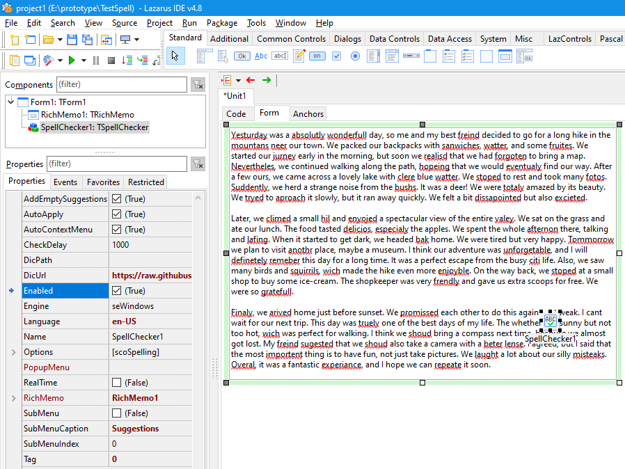

# DesignKit Package

DesignKit is a Lazarus package that provides a set of visual and non‑visual components to enhance application UI design.  
All components are installed on the **Common Controls** tab of the component palette.

## Requirements

- **Lazarus** (tested with 4.8) / **Free Pascal Compiler** 3.2.2 or newer.
- **LCL** – included with Lazarus.
- **IDEIntf** – included with Lazarus.
- **[RichMemoPackage](https://github.com/plainlib/richmemo)** – extended `TRichMemo` component with clipboard and undo helpers (available in the [plainlib](https://github.com/plainlib) repository).
- **[Helpers](https://github.com/plainlib/helpers)** – common utility units used by the spell‑checker (also available in plainlib).
- **[Toolkit](https://github.com/plainlib/toolkit)** – general‑purpose utility classes (available in plainlib).
- **[RichKit](https://github.com/plainlib/richkit)** – additional rich‑text utilities (available in plainlib).
- **Windows 8 or later** is required only for the native `WinSpellChecker` backend. The **HunSpell** backend works on all platforms (Windows, Linux, macOS) and does not need any OS‑specific API.

---

## Components

### TSpellChecker (Common Controls )



`TSpellChecker` is a non‑visual component that adds spell‑checking capabilities to a `TRichMemo` control. It supports both the native Windows Spell Checker (on Windows) and Hunspell (cross‑platform), with background checking, real‑time debounced updates, cancellation, and an automatic context menu with suggestions.

#### Features

- Background spell checking with cancellation support.
- Debounced real‑time checking (configurable delay).
- Automatic application of error underlines (with `AutoApply`).
- Built‑in context menu with spelling suggestions (replaces the word when a suggestion is chosen).
- Integration with an external `PopupMenu` – suggestions can be placed directly in the menu or inside a submenu.
- Supports Windows Spell Checker (`seWindows`) and Hunspell (`seHunspell`).
- For Hunspell: loads dictionaries from files, streams, or automatically downloads them from a URL (LibreOffice dictionaries repository).
- Events: `OnSpellCheckComplete` (reports error count), `OnContextPopup` (allows custom handling).

#### Key Properties

| Property               | Default        | Description |
|------------------------|----------------|-------------|
| `RichMemo`             | `nil`          | The `TRichMemo` control to be spell‑checked. |
| `Language`             | `''`           | BCP‑47 language tag (e.g. `'en-US'`, `'ru-RU'`). |
| `Enabled`              | `True`         | Enables/disables spell checking. |
| `Options`              | `[scoSpelling]`| Set of `TSpellCheckOptions` (`scoSpelling`, `scoComprehensive` – Windows only). |
| `AddEmptySuggestions`  | `True`         | Include errors even if no suggestions are available. |
| `RealTime`             | `False`        | Automatically check after text changes (with debounce). |
| `CheckDelay`           | `1000`         | Debounce delay in milliseconds for real‑time checks. |
| `AutoApply`            | `True`         | Automatically apply underlines after a check completes. |
| `AutoContextMenu`      | `True`         | Automatically handle `OnContextPopup` to show suggestion menu. |
| `PopupMenu`            | `nil`          | An external `TPopupMenu` to integrate suggestions into (if `nil`, uses default behaviour). |
| `SubMenu`              | `False`        | If `True`, suggestions are placed in a submenu. |
| `SubMenuCaption`       | `'Suggestions'`| Caption of the submenu when `SubMenu` is `True`. |
| `SubMenuIndex`         | `0`            | Index where suggestions (or submenu) are inserted in `PopupMenu`. |
| `Engine`               | `seWindows`    | Spell engine: `seWindows` or `seHunspell`. |
| `DicPath`              | `''`           | Directory for Hunspell dictionaries (absolute or relative to the application). |
| `DicUrl`               | `'https://raw.githubusercontent.com/LibreOffice/dictionaries/master/{libredict}'` | URL template for downloading dictionaries. Placeholders: `{dict}` (language code + .aff/.dic) or `{libredict}` (LibreOffice internal path). |

#### Events

| Event                    | Description |
|--------------------------|-------------|
| `OnSpellCheckComplete`   | Fired after a check finishes (and after underlines are applied, if `AutoApply` is `True`). Provides the number of errors found. |
| `OnContextPopup`         | Called before the component’s built‑in context menu handling. Set `Handled` to `True` to prevent the component from showing its menu. |

#### Usage

1. Place a `TSpellChecker` on a form.
2. Assign its `RichMemo` property to a `TRichMemo` control.
3. Set the `Language` property (e.g. `'en-US'`).
4. Optionally set `RealTime := True` to enable live checking.
5. At runtime, the component will automatically check the text and underline errors. Right‑click on a misspelled word to see suggestions.

Example for Hunspell with automatic download:

```pascal
var
  Spell: TSpellChecker;
begin
  Spell := TSpellChecker.Create(Self);
  Spell.RichMemo := RichMemo1;
  Spell.Language := 'ru-RU';
  Spell.Engine := seHunspell;
  Spell.DicPath := '.\dictionaries'; // local folder
  Spell.DicUrl := 'https://raw.githubusercontent.com/LibreOffice/dictionaries/master/{libredict}';
  Spell.RealTime := True;
  Spell.CheckDelay := 800;
  Spell.AutoApply := True;
end;
```

If you want to use a custom `PopupMenu` with suggestions inserted directly:

```pascal
Spell.PopupMenu := MyPopupMenu;
Spell.SubMenu := False; // suggestions appear directly in the menu
Spell.SubMenuIndex := 2; // insert after the second item
```
---

### TFormGrip (Common Controls )

`TFormGrip` is a non‑visual component that paints a size grip in the bottom‑right corner of its owner form. It allows the user to resize the form by dragging the grip, similar to the grip found in a `StatusBar`.

#### Features

- Automatically hooks into the owner form’s events for painting and mouse handling.
- Works at runtime; in design time it only draws the grip but does not interfere with the form designer.
- Multiple grip drawing styles: dots (triangular arrangement), lines, grid, or solid triangle.
- Customizable size, margin, colour, dot size, spacing, and minimum form dimensions.

#### Key Properties

| Property        | Default        | Description |
|-----------------|----------------|-------------|
| `Enabled`       | `True`         | Enables or disables the component. |
| `Active`        | `True`         | Allows resizing when `True`; when `False` the grip is drawn but not interactive. |
| `ShowGrip`      | `True`         | Controls visibility of the grip. |
| `GripSize`      | `10`           | Size of the grip area in pixels. |
| `GripMargin`    | `2`            | Offset from the right and bottom edges of the form. |
| `GripColor`     | `clActiveBorder` | Colour used to draw the grip. |
| `GripStyle`     | `gsDots`       | Drawing style: `gsDots`, `gsLines`, `gsGrid`, or `gsSolid`. |
| `DotSize`       | `2`            | Diameter of the dots (for `gsDots` and `gsGrid`). |
| `DotSpacing`    | `3`            | Distance between dots. |
| `MinFormWidth`  | `100`          | Minimum width allowed during resizing. |
| `MinFormHeight` | `100`          | Minimum height allowed during resizing. |

#### Usage

1. Drop a `TFormGrip` component onto a form from the **Common Controls** palette.
2. Adjust the properties as needed in the Object Inspector.
3. The grip will appear automatically in the bottom‑right corner of the form and allow resizing at runtime.

Example code to create and configure `TFormGrip` at runtime:

```pascal
var
  Grip: TFormGrip;
begin
  Grip := TFormGrip.Create(Self); // Self is the form
  Grip.GripStyle := gsLines;
  Grip.GripColor := clGray;
  Grip.GripMargin := 3;
  Grip.Enabled := True;
end;
```

---

### TFlatButton (Common Controls )

`TFlatButton` is a custom `TSpeedButton` descendant that always draws a flat, themed button (similar to toolbar buttons) and provides integrated tooltip support with extensive customisation.

#### Features

- Always flat (inherited `Flat` property is hidden and forced to `True`).
- Uses the native theme (via `ThemeServices`) for normal, hot, and pressed states.
- Can optionally disable the pressed state drawing (`DrawPressed`).
- Allows vertical offset of the caption relative to the icon (`OffsetY`).
- Built‑in tooltip system with delay, size, colour, and auto‑hide duration.
- Tooltips are displayed using `TOneShotTooltip` and automatically hide when the button is clicked or the tooltip is dismissed.

#### Key Properties

| Property            | Default     | Description |
|---------------------|-------------|-------------|
| `DrawPressed`       | `True`      | If `False`, the button never appears pressed (visual state is always normal or hot). |
| `OffsetY`           | `0`         | Vertical pixel offset for the caption relative to the centre of the icon (positive moves text down). |
| `Tooltip`           | `''`        | The tooltip text to display (translatable caption). |
| `TooltipDelay`      | `0`         | Delay in milliseconds before the tooltip appears after a click (0 = immediate). |
| `TooltipWidth`      | `0`         | Width of the tooltip window (0 = auto‑size). |
| `TooltipHeight`     | `0`         | Height of the tooltip window (0 = auto‑size). |
| `TooltipColor`      | `clDefault` | Background colour of the tooltip (`clDefault` uses system default). |
| `TooltipDuration`   | `0`         | Time in milliseconds after which the tooltip auto‑hides (0 = no auto‑hide). |

#### Usage

Place a `TFlatButton` on a form, set an `Images` or `Glyph` for the icon, adjust `Caption`, and configure the tooltip properties.

Example:

```pascal
var
  Btn: TFlatButton;
begin
  Btn := TFlatButton.Create(Self);
  Btn.Parent := Self;
  Btn.Caption := 'Save';
  Btn.ImageIndex := 0; // assume an ImageList assigned
  Btn.Tooltip := 'Save the current document';
  Btn.TooltipDelay := 500;
  Btn.TooltipDuration := 3000;
  Btn.OffsetY := 2; // move text slightly down
end;
```

---

## Installation

1. Open the package file (`designkit.lpk`) in Lazarus.
2. Click **Use** → **Install**.
3. Rebuild the IDE.

The components will appear on the **Common Controls** tab of the component palette.

---

*DesignKit Package © 2026 by Alexander Tverskoy*  
*Licensed under the MIT License – see the individual source files for details.*